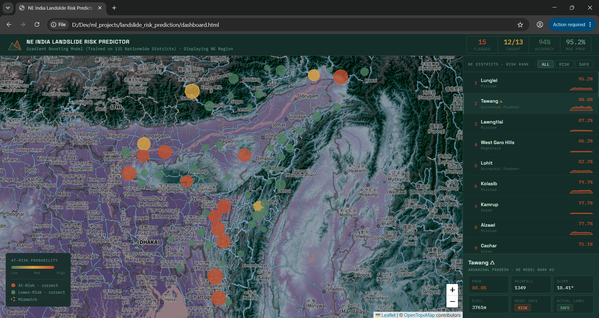
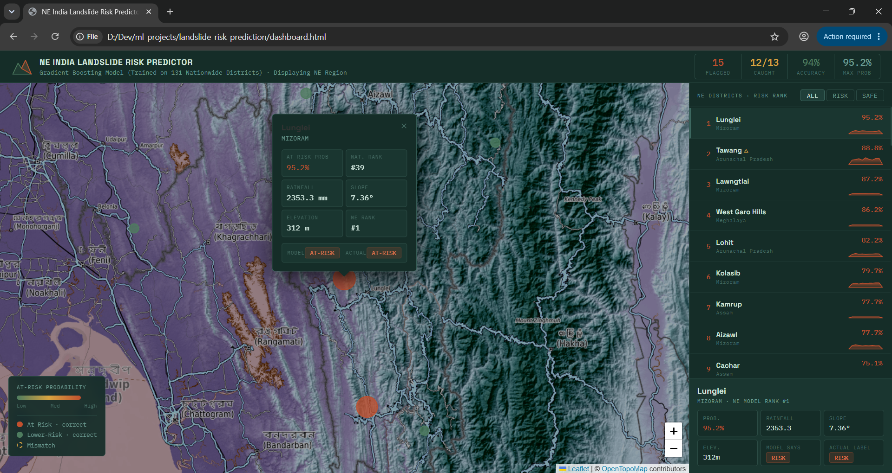
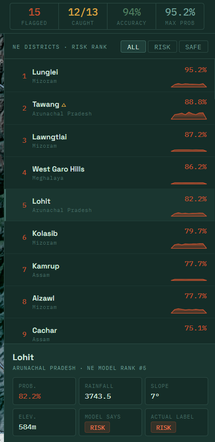
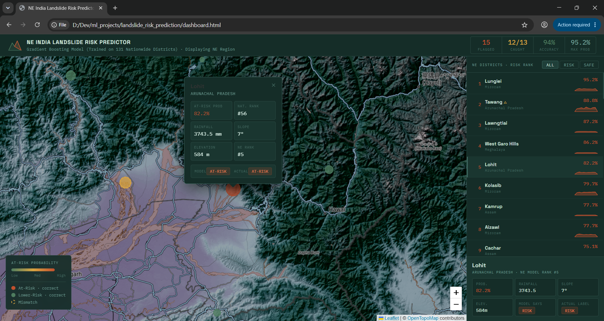

# NE India Landslide Risk Predictor

An end-to-end ML pipeline that predicts landslide risk for districts in
Northeast India, using rainfall, terrain slope, and elevation data — trained
on a nationwide dataset for stronger signal, then focused on the NE India
region for the final tool.



## Why this project

Northeast India — the Brahmaputra basin, the hill districts of Meghalaya,
Mizoram, and Arunachal Pradesh — faces real, recurring landslide risk during
the monsoon season. This project explores whether publicly available
rainfall and terrain data can predict which districts are most at risk,
and documents an honest, iterative process of building that model —
including what didn't work along the way.

## What it does

- Predicts landslide risk probability for districts using a Gradient
  Boosting model trained on rainfall, slope, and elevation
- Visualizes results on an interactive topographic map of NE India
- Shows each district's model prediction against its actual ISRO-ranked
  exposure label, including where the model was right and where it wasn't



## Data sources

| Data | Source |
|---|---|
| District risk exposure ranking | ISRO/NRSC Landslide Atlas of India |
| Coordinates | OpenStreetMap (Nominatim) |
| Rainfall (10-year average) | Open-Meteo Historical Weather API |
| Slope & elevation | OpenTopography (SRTM DEM) and Open-Topo-Data |

## Pipeline

1. **Data collection** — scripted collection of coordinates, rainfall,
   slope, and elevation for districts nationwide (131 clean districts after
   removing failed lookups)
2. **Labeling** — districts ranked in India's top 60 nationally for
   landslide exposure are labeled At-Risk; the rest, Lower-Risk
3. **Modeling** — compared Logistic Regression, Random Forest, Gradient
   Boosting, and SVM using 5-fold stratified cross-validation, evaluated on
   At-Risk F1 score (not overall accuracy, which is misleading under class
   imbalance)
4. **Final model** — Gradient Boosting, selected for its higher precision
   and more decisive confidence scores
5. **Dashboard** — model trained on all 131 districts, results filtered to
   display the NE India region specifically



## Results

| Iteration | Dataset size | At-Risk F1 | Max confidence |
|---|---|---|---|
| Baseline (Logistic Regression) | 57 districts (NE only) | 0.00 | 31.9% |
| Class-weighted / Random Forest | 57 districts (NE only) | 0.18–0.25 | 31.9% |
| SVM (best of first round) | 57 districts (NE only) | 0.40 | 31.9% |
| **Gradient Boosting (final)** | **131 districts (nationwide)** | **0.56** | **98.1%** |

Scaling from 57 to 131 districts nearly doubled precision (29% → 57%) and
resolved a probability-compression issue where the model was never
confident about any prediction, regardless of which algorithm was used.

## Key findings & honest limitations

- **Model type mattered less than data volume.** Every algorithm
  underperformed on the small 57-district dataset; the real fix was more
  training data, not a better model.
- **Rainfall and slope alone are proxies, not direct evidence.** The
  ISRO ranking used to generate labels also factors in population, road,
  and livestock exposure — features this model doesn't have. Some
  mismatches (e.g. a physically steep, high-elevation district predicted
  At-Risk but labeled Lower-Risk) likely reflect that gap, not model error.
- **A UI/visualization bug was caught and fixed mid-project** — an early
  dashboard version min-max normalized prediction probabilities into a
  misleading 0–100 "risk score," making a genuinely low-confidence model
  (max 31.9%) look artificially certain (100/100). This was corrected to
  show raw, honest probabilities.
- **Natural next steps** (not yet done): incorporating real historical
  landslide event locations (NASA COOLR) and vegetation cover (NDVI) as
  features, which would add genuine causal signal beyond rainfall/slope/
  elevation proxies.

## Tech stack

Python · pandas · scikit-learn · requests · Leaflet.js · HTML/CSS/JS

## Screenshots

| | |
|---|---|
|  |  |

## Running it locally

```bash
pip install requests pandas scikit-learn

# 1. Collect data (rainfall, slope, elevation for all districts)
python build_full_dataset.py

# 2. Train and compare models
python build_model.py

# 3. Open dashboard/index.html in a browser
```
